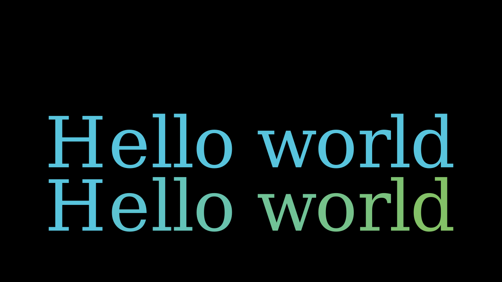

# 运行
```shell
./build.cmd
```
# 参考
[官网参考](https://docs.manim.community/en/stable/reference/manim.mobject.text.text_mobject.Text.html)
# 运行main1
```shell
manim -qm main1.py Main1
```
-qm（或 --quality=m） 
指定渲染质量，m 表示 medium（中等质量）。
Manim 支持不同渲染质量：  
l（low，低质量）  
m（medium，中等质量，默认）  
h（high，高质量）  
p（production，生产级质量）  
k（4K 超高清）  

## Main1
```python
text2 = Text('Hello world', gradient=(BLUE, GREEN)).scale(3).next_to(text1, DOWN)
```
- 这段代码创建了一个带有蓝绿渐变颜色的放大文本，并将其定位到另一个文本对象 text1 的下方
## 结果

# 运行main2
```shell
manim -qm main2.py Main2
```
## Main2
```python
text = Text("Hello world", t2c={'o': YELLOW}, disable_ligatures=True)
```
- 这段代码创建了一个文本对象，其中字母 "o" 被着色为黄色，并禁用了连字功能
## 结果


# 运行main3
```shell
manim -qm main3.py Main3
```
## Main3
```python
        text1 = Text(
            'Google',
            t2c={'[:1]': '#3174f0', '[1:2]': '#e53125',
                 '[2:3]': '#fbb003', '[3:4]': '#3174f0',
                 '[4:5]': '#269a43', '[5:]': '#e53125'}, font_size=58).scale(3)
```
- 这段代码创建了一个文本对象 "Google"，并为每个字母指定了不同的颜色